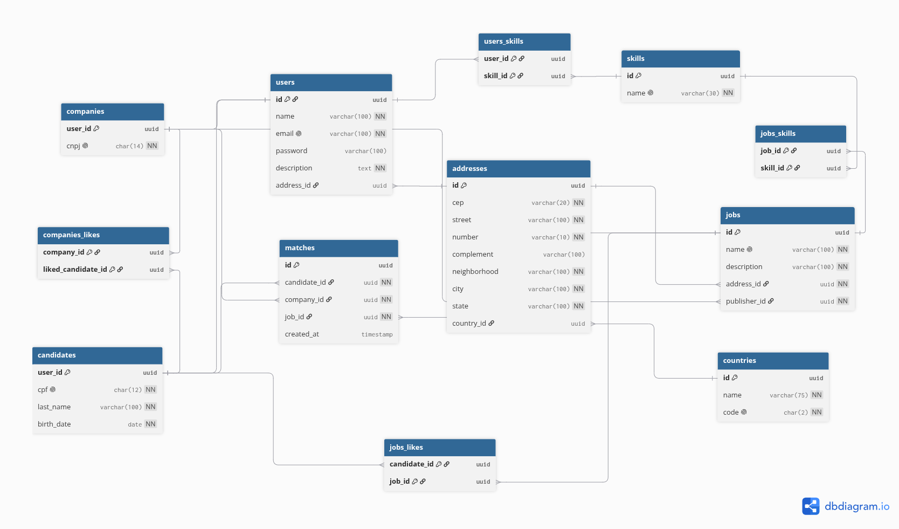

# Linketinder

Name: Gildésio Araújo Félix

Sistema desenvolvido para conectar candidatos e empresas através de cadastro, busca por habilidades e criação de matches entre perfis com interesse mútuo. 
O projeto conta com um **Back-end em Groovy** executado em console e uma **Interface Web (Front-end)** construída com HTML, CSS e TypeScript.

## Front-end (Interface Web)

O projeto possui uma interface web interativa para acesso dos candidatos e empresas, construída com:
* **HTML5** e **CSS3** (utilizando Flexbox, Grid e variáveis CSS)
* **TypeScript** (manipulação do DOM, regras de negócio no frontend e tipagem estática)
* **LocalStorage** para persistência de dados no navegador

### Funcionalidades do Front-end
* **Login e Cadastro**: Fluxos de autenticação para empresas e candidatos.
* **Área de Vagas (Candidatos)**: Visualização de vagas, recomendação baseada em competências (skills) e área de "Meus Matches". Os cards de vagas exibem as informações da empresa e suas respectivas exigências, permitindo dar *Like*.
* **Área de Candidatos (Empresas)**: Painel estilo *dashboard* com métricas e cards de candidatos disponíveis, onde a empresa pode visualizar as skills e manifestar interesse.
* **Edição de Perfil**: O usuário pode alterar suas informações pessoais, descrição, localização e editar sua lista de competências.

### Como executar o Front-end
O front-end não requer processos de build complexos. Basta abrir a pasta `frontend/pages/` e executar o arquivo `login.html` no seu navegador. Para uma melhor experiência e evitar problemas de CORS ao transitar entre módulos locais, é recomendado o uso de um servidor local leve (como o *Live Server* no VS Code ou `python -m http.server`).

## Funcionalidades

### Candidatos

* Listar todos os candidatos
* Buscar candidato por CPF
* Filtrar candidatos por skill
* Cadastrar candidato
* Atualizar candidato
* Remover candidato

### Empresas

* Listar todas as empresas
* Buscar empresa por CNPJ
* Filtrar empresas por skill
* Cadastrar empresa
* Atualizar empresa
* Remover empresa

### Sistema de Matches

* Login com CPF ou CNPJ
* Visualizar perfis compatíveis
* Curtir perfis
* Ver matches recíprocos

## Tecnologias utilizadas

* **Groovy** — Linguagem principal do back-end
* **Gradle** — Build tool e gerenciamento de dependências
* **PostgreSQL 15** — Banco de dados relacional (via Docker)
* **Flyway 13.7** — Controle de versão e migrations do banco de dados
* **HikariCP 5.1** — Connection pool JDBC de alta performance
* **Groovy SQL** — Acesso ao banco de dados via JDBC
* **Docker / Docker Compose** — Containerização do banco PostgreSQL
* **Spock Framework** — Testes automatizados
* **Interface de console** — Interação com o usuário via terminal

## Estrutura do projeto

```text
backend/
├── docker-compose.yaml          # Container PostgreSQL
├── build.gradle                 # Dependências e config Flyway
└── src/
    └── main/
        ├── groovy/
        │   └── zg/
        │       └── acelera/
        │           ├── app/             # Menu principal
        │           ├── service/         # Regras de negócio
        │           ├── repository/      # Persistência (JDBC / PostgreSQL)
        │           ├── user_interface/  # Menus de interação
        │           ├── domain/          # Entidades do sistema
        │           ├── dto/             # Data Transfer Objects
        │           ├── utils/
        │           │   ├── db/          # DatabaseManager (HikariCP)
        │           │   └── exception/   # Exceções customizadas
        │           └── Main.groovy
        └── resources/
            └── db/
                ├── migration/           # Flyway migrations (schema)
                │   ├── V1__create_core_entities.sql
                │   ├── V2__fixing_address_and_user_relationship.sql
                │   ├── V3__add_delete_cascade_on_user_relationships.sql
                │   └── V4__add_delete_cascade_on_job_relatioships.sql
                └── testdata/            # Dados mocados para dev
                    └── mock.sql
```

## Integração com Banco de Dados (PostgreSQL)

A persistência de dados foi migrada de **arquivos JSON** para um banco de dados **PostgreSQL** gerenciado via **Docker Compose**, com migrations controladas pelo **Flyway** e pool de conexões **HikariCP**.

### O que mudou

| Aspecto | Antes | Depois |
|---|---|---|
| **Persistência** | Arquivos JSON (`candidates.json`, `companies.json`) | PostgreSQL 15 via Docker |
| **Repositórios** | `CandidateRepository` / `CompanyRepository` (JSON) | `*RepositoryJDBC` (SQL nativo) |
| **Conexão** | Leitura/escrita em arquivo | HikariCP connection pool |
| **Schema** | Manual (`db/script.sql`) | Flyway migrations versionadas |
| **Dados de teste** | JSONs pré-preenchidos | Script SQL mocado separado (`testdata/mock.sql`) |

### Repositórios JDBC implementados

Todos os repositórios seguem interfaces (`I*Repository`) e utilizam `groovy.sql.Sql` com HikariCP:

* `CandidateRepositoryJDBC` — CRUD de candidatos com skills (N:N)
* `CompanyRepositoryJDBC` — CRUD de empresas com skills (N:N)
* `JobRepositoryJDBC` — CRUD de vagas com skills (N:N)
* `AddressRepositoryJDBC` — Gerenciamento de endereços vinculados a usuários/vagas
* `SkillRepositoryJDBC` — Consulta e gestão de competências
* `CountryRepositoryJDBC` — Consulta de países

### Migrations (Flyway)

As migrations estão em `src/main/resources/db/migration/` e são executadas em ordem:

| Migration | Descrição |
|---|---|
| `V1__create_core_entities.sql` | Cria todas as tabelas: `countries`, `skills`, `addresses`, `users`, `companies`, `candidates`, `users_skill`, `jobs`, `jobs_skill` |
| `V2__fixing_address_and_user_relationship.sql` | Inverte a relação `users ↔ addresses`: remove `address_id` de `users` e adiciona `user_id` em `addresses` |
| `V3__add_delete_cascade_on_user_relationships.sql` | Adiciona `ON DELETE CASCADE` em `candidates`, `companies`, `users_skill` e `addresses` |
| `V4__add_delete_cascade_on_job_relatioships.sql` | Adiciona `ON DELETE CASCADE` em `jobs` (publisher) e `jobs_skill` |

### Dados mocados (`testdata/mock.sql`)

O arquivo `mock.sql` contém dados de teste para ambiente de desenvolvimento:

* **1 país** (Brasil)
* **4 skills** (Java, Spring Boot, PostgreSQL, React)
* **5 candidatos** com CPF e data de nascimento
* **5 empresas** com CNPJ
* **2 endereços** (São Paulo e Rio de Janeiro)

## Requisitos

Antes de executar o projeto, certifique-se de possuir:

* **Java 21 ou superior**
* **Docker** e **Docker Compose**
* **Gradle Wrapper** (incluso no projeto)

O projeto utiliza o **Gradle Wrapper**, portanto não é necessário ter uma instalação global do Gradle.

## Como executar

### 1. Clonar o repositório

```bash
git clone https://github.com/Gildesio-af/Linketinder-Project.git
cd Linketinder/backend
```

### 2. Subir o banco de dados PostgreSQL

```bash
docker compose up -d
```

Isso inicia um container PostgreSQL 15 com as seguintes configurações:

| Parâmetro | Valor |
|---|---|
| Host | `localhost` |
| Porta | `5433` |
| Banco | `postgres` |
| Usuário | `postgres` |
| Senha | `123456` |

### 3. Rodar as migrations do Flyway

**Somente as migrations (schema do banco):**

```bash
./gradlew flywayMigrate
```

**Migrations + dados mocados para testes/desenvolvimento:**

```bash
./gradlew flywayMigrate -Penv=dev
```

> **📝 Nota:** A flag `-Penv=dev` inclui os scripts da pasta `testdata/` (com o `mock.sql`) além das migrations padrão. Sem essa flag, apenas o schema é criado (sem dados de exemplo).

**Limpar o banco e recriar do zero:**

```bash
./gradlew flywayClean flywayMigrate -Penv=dev
```

> ⚠️ O comando `flywayClean` **apaga todas as tabelas** do banco. Use com cuidado.

### 4. Compilar e executar

#### Opção A — Pela IDE (recomendado)

Abra o projeto no **IntelliJ IDEA**, configure o SDK para **Java 21+** e execute o arquivo:

```text
src/main/groovy/zg/acelera/Main.groovy
```

#### Opção B — Pelo terminal

```bash
./gradlew clean classes
groovy -cp build/classes/groovy/main src/main/groovy/zg/acelera/Main.groovy
```

### Variáveis de ambiente (opcional)

Para conectar a um banco diferente, defina as variáveis de ambiente antes de executar:

```bash
export DB_URL="jdbc:postgresql://localhost:5433/postgres"
export DB_USER="postgres"
export DB_PASSWORD="123456"
```

Essas variáveis são utilizadas tanto pelo **Flyway** (`build.gradle`) quanto pelo **DatabaseManager** (HikariCP) da aplicação.

## Como usar

Ao iniciar a aplicação, o sistema apresenta um **menu principal** com acesso às seguintes áreas:

* **Candidatos**
* **Empresas**
* **Vagas**
* **Login e Matches**

### Área de candidatos

Permite:

* Listar candidatos
* Buscar por CPF
* Filtrar por skill
* Cadastrar candidatos (com endereço e skills do banco)
* Atualizar candidatos
* Remover candidatos (com cascade nas relações)

### Área de empresas

Permite:

* Listar empresas
* Buscar por CNPJ
* Filtrar por skill
* Cadastrar empresas (com endereço e skills do banco)
* Atualizar empresas
* Remover empresas (com cascade nas relações)

### Área de vagas

Permite:

* Listar todas as vagas
* Buscar vagas por nome ou skill
* Listar vagas de uma empresa
* Criar vagas (com endereço e skills exigidas)
* Atualizar vagas
* Remover vagas (com cascade nas skills vinculadas)

### Sistema de login e matches

Após realizar o login utilizando **CPF ou CNPJ**, o usuário pode:

1. Visualizar perfis compatíveis.
2. Curtir perfis de interesse.
3. Verificar os matches recíprocos.

Um **match** ocorre quando existe interesse mútuo entre os perfis.

## Skills suportadas

As skills são gerenciadas diretamente no banco de dados. Os dados mocados incluem:

```text
Java
Spring Boot
PostgreSQL
React
```

Novas skills podem ser adicionadas diretamente no banco via `INSERT` ou por futuras funcionalidades da aplicação.

## Arquitetura

O projeto organiza suas responsabilidades em diferentes camadas:

```text
┌─────────────────────────────┐
│       User Interface        │
│     Menus / Interação       │
└──────────────┬──────────────┘
               │
               ▼
┌─────────────────────────────┐
│           Service           │
│       Regras de negócio     │
└──────────────┬──────────────┘
               │
               ▼
┌─────────────────────────────┐
│     Repository (JDBC)       │
│   Groovy SQL + HikariCP     │
└──────────────┬──────────────┘
               │
               ▼
┌─────────────────────────────┐
│     PostgreSQL (Docker)     │
│   Flyway Migrations         │
└─────────────────────────────┘
```

Essa separação permite manter a **interface**, as **regras de negócio**, a **persistência** e as **entidades** organizadas em responsabilidades distintas.

## Objetivo

O **Linketinder** tem como objetivo simular uma plataforma de conexão entre **profissionais e empresas**, permitindo o gerenciamento dos perfis, a busca por habilidades e a identificação de interesses mútuos por meio do sistema de matches.

## Modelagem de Banco de Dados (PostgreSQL)

O sistema conta com uma modelagem relacional avançada desenvolvida no PostgreSQL, estruturada para garantir a integridade dos dados e facilitar o mapeamento objeto-relacional (ORM) no back-end.

A arquitetura do banco aplica conceitos de normalização (3NF) e herança de tabelas:

* **Especialização de Usuários (Tabelas Vinculadas):** Utiliza uma superclasse `users` para concentrar dados comuns (autenticação e descrição) e subclasses `candidates` e `companies` para armazenar os atributos exclusivos de cada perfil (como CPF e CNPJ).
* **Normalização de Endereços e Competências:** Entidades como `addresses`, `countries` e `skills` foram isoladas em tabelas independentes, evitando redundância e garantindo a padronização das buscas por localização e habilidades.
* **Sistema de Vagas (Jobs):** Empresas possuem uma relação de 1:N com vagas, que por sua vez possuem relacionamentos N:N com as competências exigidas.
* **Lógica de Matches:** O cruzamento de interesses é registrado na tabela `matches`, que consolida o evento triplo: o candidato que demonstrou interesse na vaga e a empresa que demonstrou interesse no candidato.

### Diagrama Entidade-Relacionamento (DER)

Abaixo está a representação visual do banco de dados criado na ferramenta **dbdiagram.io**:

